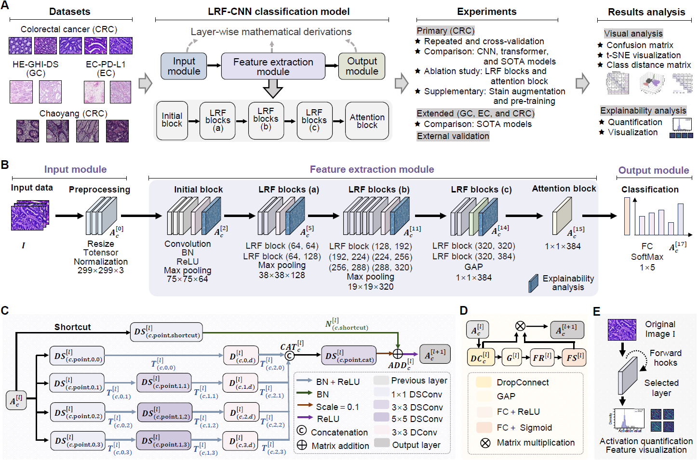

# [iScience 2026] LRF-CNN: An explainable lightweight receptive field-based CNN for colorectal cancer histopathological image classification

## Authors

Lingling Yuan, Chen Li*, Jinghua Zhang, Hongzan Sun, Md Rahaman, Marcin Grzegorzek, Xiaoyan Li*

## Abstract

Colorectal cancer (CRC) diagnosis increasingly depends on histopathological assessment, where accurate and trustworthy image classification can help reduce workload and support clinical decision-making.
However, many high-performing deep learning models are computationally expensive and difficult to interpret, which limits their practical use in resource-constrained and high-stakes scenarios.

To address these issues, we propose **LRF-CNN**, an **explainable and lightweight receptive field-based convolutional neural network** for histopathological image classification. The model introduces multi-branch lightweight receptive field (LRF) blocks together with an attention block that combines DropConnect and squeeze-and-excitation (SENet) to improve feature representation while reducing overfitting.
For explainability, the framework further includes post-hoc activation quantification and multi-stage feature-map visualization to analyze model behavior and interpret errors.

Primary experiments on the publicly available EBHI dataset demonstrate strong and stable performance, achieving a mean accuracy of 92.09% through repeated experiments and cross-validation. Additional evaluations on HE-GHI-DS, PD-L1 EC, and Chaoyang, as well as an external-validation setting under domain shift, further show that LRF-CNN achieves a favorable balance between classification performance, computational efficiency, and explainability.

## Datasets

1. EBHI (Colorectal Histopathology, Primary Dataset)
EBHI is the primary benchmark used in this work for five-class colorectal histopathological image classification.
Open-source link: https://figshare.com/articles/dataset/EBH-HE-IDS/16999363/1

2. HE-GHI-DS (Gastric Histopathology)
HE-GHI-DS is used for binary gastric histopathological image classification.
Open-source link: https://data.mendeley.com/datasets/thgf23xgy7/2

3. EC-PD-L1 (Esophageal Cancer, PD-L1 Status Prediction)
EC-PD-L1 is used for binary PD-L1 status prediction in esophageal cancer.
Open-source link: https://doi.org/10.6084/m9.figshare.31989708

4. Chaoyang (Colorectal Histopathology)
Chaoyang is used for additional evaluation on four-class colorectal histopathological image classification.
Open-source link: https://bupt-ai-cz.github.io/HSA-NRL/

## Experimental Settings

All experiments follow a unified configuration unless otherwise specified.
The model is implemented using Python 3.8.18 and PyTorch 1.13.1+cu117 on a workstation equipped with Windows 10, 32 GB RAM, and an NVIDIA Quadro RTX 4000 GPU (8 GB).

During preprocessing, all images are resized to 299 × 299, converted to RGB when necessary, transformed to tensors with pixel values scaled to [0, 1], and normalized using the channel-wise mean and standard deviation computed from the training split of each dataset.
Model weights are randomly initialized, and the random seed is fixed to 42 for reproducibility.
Training is performed for 100 epochs with a batch size of 8, using the Adam optimizer with an initial learning rate of 1e-4, weight decay of 1e-5, and a StepLR scheduler that multiplies the learning rate by 0.5 every 20 epochs. The optimization objective is cross-entropy loss.

For standard experiments, the dataset split is fixed at 60% / 20% / 20% for training, validation, and testing. For five-fold cross-validation experiments on EBHI, the 20% test set is kept fixed and cross-validation is performed only on the remaining 80% of the data.

Performance is evaluated using Accuracy, Precision, Recall, and F1-score, and the study further reports Mean, Std, CV, 95% confidence interval, and Friedman test p-values for statistical analysis.
