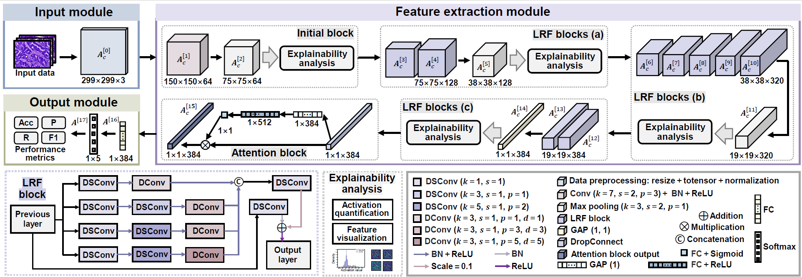

# LRF-CNN: Explainable Lightweight Receptive Field-based CNN for Histopathological Image Classification

**Status:** Under Review

## Authors

Lingling Yuan, Chen Li\*, Jinghua Zhang, Hongzan Sun, Md Rahaman, Marcin Grzegorzek, Xiaoyan Li\*

## Abstract

This repository provides the official implementation of LRF-CNN, a lightweight and explainable convolutional neural network designed for histopathological image classification. The model integrates multi-branch receptive field (LRF) blocks and an attention mechanism, and is validated on colorectal (EBHI), gastric (HE-GHI-DS), and esophageal cancer (PD-L1 EC) datasets.
  

## Datasets

### EBHI (Colorectal Cancer)
- **Classes:** Normal, Polyp, Low-grade IN, High-grade IN, Adenocarcinoma  
- **Format:** JPEG, 2048×1536 @ 200×  
- **Public:** ✔  
- **Link:** [EBHI on Figshare](https://figshare.com/articles/dataset/EBH-HE-IDS/16999363/1)

###  HE-GHI-DS (Gastric Cancer)
- **Classes:** Normal, Abnormal  
- **Format:** TIFF, 2048×2048 @ 20×  
- **Public:** ✔  
- **Link:** [HE-GHI-DS on Mendeley](https://data.mendeley.com/datasets/thgf23xgy7/2)

### PD-L1 EC (Esophageal Cancer)
- **Classes:** Positive, Negative  
- **Format:** PNG, 290×320  
- **Public:** ✘ *Private dataset*  
- **Note:** To request access, please contact the first author via email [yuanlingling0314@163.com](mailto:yuanlingling0314@163.com)
